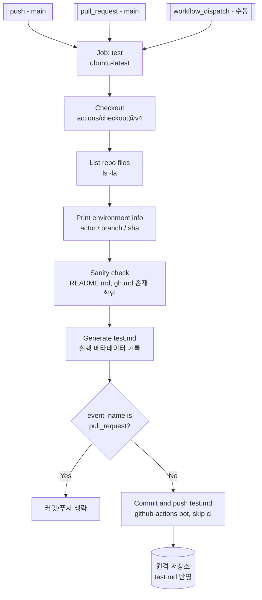

## 기술 스택

이 저장소는 **KRX 유가증권 일별매매정보를 조회·표시하는 Python 웹 애플리케이션**과 보조 자동화 스크립트로 구성됩니다. 아래 표는 소스 코드와 `requirements.txt`를 기준으로 정리한 현재 기술 스택입니다.

| 영역 | 기술 | 사용 목적 |
|---|---|---|
| 백엔드 | Python 3, FastAPI, Pydantic | REST API 제공, 요청·응답 모델 검증, 정적 파일 서빙 |
| ASGI 서버 | Uvicorn | FastAPI 애플리케이션 로컬 실행 |
| 외부 데이터 연동 | KRX Data API, Python 표준 라이브러리(`urllib`) | KOSPI 일별매매정보를 날짜별로 조회 |
| 동시성 | `concurrent.futures.ThreadPoolExecutor` | 여러 거래일의 KRX API 요청을 제한된 병렬성으로 처리 |
| 프런트엔드 | HTML5, CSS3, Vanilla JavaScript | 조회 화면, 날짜 입력, API 호출 및 결과 표시 |
| 데이터 그리드 | AG Grid Community 36.1.0 (jsDelivr CDN) | 정렬·필터·페이지네이션·CSV 다운로드 기능 제공 |
| 브라우저 자동화 | Playwright for Python, Chromium | `capture_naver.py`를 통한 웹 페이지 화면 캡처 |
| CI/저장소 운영 | Git, GitHub, GitHub Actions, GitHub CLI (`gh`) | 버전 관리, 워크플로우 실행 및 GitHub 리소스 관리 |

### 구성 원칙

- 프런트엔드는 별도 번들러나 프레임워크 없이 FastAPI가 `/static` 경로로 직접 제공합니다.
- 외부 UI 라이브러리는 AG Grid CDN만 사용합니다.
- KRX 인증 키는 Codespaces secret으로 주입되는 `KRX_KEY` 환경변수 또는 로컬 `.key` 파일에서 읽으며, `.key`는 Git에서 제외됩니다.
- 자동화 테스트 프레임워크는 아직 구성되어 있지 않습니다. 현재 GitHub Actions는 저장소 점검과 `test.md` 리포트 생성에 집중합니다.

## KRX 유가증권 일별매매정보 API

FastAPI 서비스는 Codespaces secret으로 주입되는 `KRX_KEY` 환경변수(우선) 또는 `.key` 파일의 `KRX-KEY`를 사용해 KRX 유가증권 일별매매정보를 기간 단위로 조회합니다. 키는 Git에 포함되지 않습니다.

GitHub CLI로 Codespaces secret을 등록한 뒤 Codespace를 새로 만들거나 다시 시작합니다.

```bash
gh secret set KRX_KEY --user --app codespaces
```

```bash
pip install -r requirements.txt
uvicorn krx_daily_api:app --reload
```

서버를 실행한 뒤 `http://127.0.0.1:8000/`에서 AG Grid Community 기반의 조회 화면을 사용할 수 있습니다. 그리드는 정렬, 열 필터, 페이지네이션과 CSV 다운로드를 지원합니다.

조회 예시:

```bash
curl 'http://127.0.0.1:8000/api/v1/stocks/daily?from=2026-08-24&to=2026-08-28'
```

- `from`, `to`: `YYYYMMDD` 또는 `YYYY-MM-DD` 형식
- 최대 조회 기간: 366일
- 주말은 자동으로 건너뜁니다. 휴장일은 빈 결과로 제외됩니다.
- Swagger UI: `http://127.0.0.1:8000/docs`

## GitHub Actions 상세

워크플로우 이름: `Test` (`.github/workflows/test.yml`)

### 트리거

| 이벤트 | 브랜치 | 설명 |
|---|---|---|
| `push` | `main` | main에 push될 때마다 실행 |
| `pull_request` | `main` | main 대상 PR 생성/갱신 시 실행 |
| `workflow_dispatch` | - | Actions 탭 또는 `gh workflow run`으로 수동 실행 |

### 권한

- `permissions: contents: write` — 워크플로우가 저장소에 커밋/푸시할 수 있도록 부여

### Job: `test` (`ubuntu-latest`)

1. **Checkout** — `actions/checkout@v4`로 저장소 코드 가져오기
2. **List repo files** — `ls -la`로 파일 목록 출력 (디버깅용)
3. **Print environment info** — `github.actor`, `github.ref_name`, `github.sha` 등 컨텍스트 값 출력
4. **Sanity check** — `README.md`, `gh.md` 존재 여부 확인
5. **Generate test.md** — 실행 번호, 트리거 이벤트, 액터, 브랜치, 커밋 SHA, 생성 시각을 담은 `test.md` 리포트 생성
6. **Commit and push test.md** — 변경된 `test.md`를 `github-actions[bot]` 계정으로 커밋 후 원격 저장소로 push
   - `pull_request` 이벤트에서는 이 단계를 건너뜀 (PR 컨텍스트는 push 권한이 제한적일 수 있음)
   - 커밋 메시지에 `[skip ci]`를 붙여 재귀 실행 방지 (GITHUB_TOKEN으로 만든 push는 기본적으로 워크플로우를 재트리거하지 않지만, 이중 안전장치로 추가)
   - 변경 사항이 없으면 커밋 없이 스킵

### 로컬에서 수동 실행

```bash
gh workflow run test.yml
gh run list --workflow test.yml
gh run view --log
```

### 워크플로우 다이어그램



## Git 브랜치 명령어: checkout vs switch

`git checkout`은 브랜치 전환, 커밋 체크아웃, 파일 복원까지 겸하는 다목적 명령이고, `git switch`는 그중 브랜치 전환 기능만 분리한 최신(Git 2.23+) 명령이다.

**git checkout**
```bash
git checkout main              # 브랜치 전환
git checkout -b new-branch     # 브랜치 생성+전환
git checkout <commit-sha>      # detached HEAD로 이동
git checkout -- file.txt       # 파일을 마지막 커밋 상태로 되돌림 (변경사항 유실 위험)
```
브랜치 이름과 파일 경로를 문맥으로 구분하므로, 같은 이름의 브랜치와 파일이 있으면 혼동되거나 실수로 파일을 덮어쓸 위험이 있다.

**git switch** (브랜치 전용, 더 안전)
```bash
git switch main                # 브랜치 전환
git switch -c new-branch       # 브랜치 생성+전환 (checkout -b와 동일)
git switch -d <commit-sha>     # detached HEAD (checkout과 동일)
```
파일 복원 기능이 없어 의도치 않은 파일 유실 위험이 없다. 파일 복원은 `git restore`로 분리되었다 (`git restore -- file.txt`).
